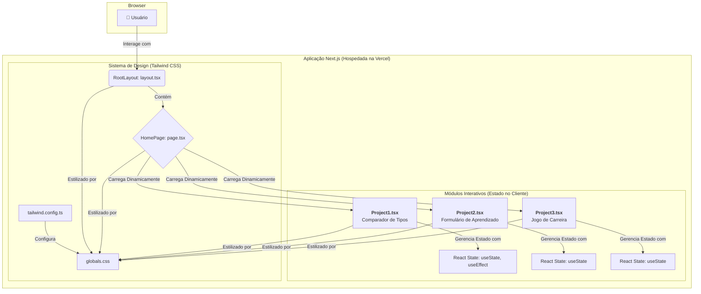

# Seven Days of Code: Uma Exploração Interativa de Fundamentos da Programação

**Codificando a Lógica: Uma Jornada Prática Através de Desafios Fundamentais com Next.js e React.**

<p align="center">
  <a href="https://seven-of-days-code.vercel.app" target="_blank" rel="noopener noreferrer">
    
  </a>
</p>

---

## Abstract (Resumo Técnico)

Este projeto, intitulado "Seven Days of Code", materializa-se como uma aplicação web educacional desenvolvida em resposta ao desafio homônimo da Alura. O seu propósito fundamental é transpor a lacuna entre o conhecimento teórico dos fundamentos da programação — como coerção de tipos, lógica condicional e gerenciamento de estado — e sua aplicação pragmática no ecossistema de desenvolvimento web moderno. 

O desafio central abordado é a dificuldade que aprendizes frequentemente encontram em visualizar e interagir com conceitos lógicos abstratos. A solução proposta consiste em uma aplicação single-page composta por três módulos interativos e autocontidos, onde cada um encapsula um desafio de programação fundamental, permitindo ao usuário explorar e compreender as consequências de suas decisões em tempo real.

A metodologia empregada baseia-se em um stack tecnológico robusto e contemporâneo, utilizando Next.js 14 como framework de base, React 18 para interface reativa, e Tailwind CSS para um sistema de design utility-first. O resultado é uma ferramenta pedagógica que não apenas resolve os desafios propostos, mas também demonstra proficiência em práticas de desenvolvimento front-end moderno.

## Badges Abrangentes


## Sumário (Table of Contents)

1. [Introdução e Motivação](#introdução-e-motivação)
2. [🔗 Link Principal / Acesso ao Projeto](#-link-principal--acesso-ao-projeto)
3. [Arquitetura do Sistema](#arquitetura-do-sistema)
4. [Decisões de Design Chave](#decisões-de-design-chave)
5. [✨ Funcionalidades Detalhadas (com Casos de Uso)](#-funcionalidades-detalhadas-com-casos-de-uso)
6. [🛠️ Tech Stack Detalhado](#️-tech-stack-detalhado)
7. [📂 Estrutura Detalhada do Código-Fonte](#-estrutura-detalhada-do-código-fonte)
8. [📋 Pré-requisitos Avançados](#-pré-requisitos-avançados)
9. [🚀 Guia de Instalação e Configuração Avançada](#-guia-de-instalação-e-configuração-avançada)
10. [⚙️ Uso Avançado e Exemplos](#️-uso-avançado-e-exemplos)
11. [🧪 Estratégia de Testes e Qualidade de Código](#-estratégia-de-testes-e-qualidade-de-código)
12. [🚢 Deployment Detalhado e Escalabilidade](#-deployment-detalhado-e-escalabilidade)
13. [❓ FAQ (Perguntas Frequentes)](#-faq-perguntas-frequentes)
14. [📜 Licença e Aspectos Legais](#-licença-e-aspectos-legais)
15. [📞 Contato](#-contato)

## Introdução e Motivação

A programação, em sua essência, é a arte de instruir uma máquina através da lógica. No entanto, a transição dos conceitos lógicos — como tipos de dados, operadores de comparação, estruturas condicionais e fluxo de controle — do plano abstrato para a implementação prática em aplicações ricas e interativas representa um desafio significativo para desenvolvedores em formação.

Este projeto nasceu da motivação de superar essa barreira, inspirado pelo desafio **"7 Days of Code"** da Alura. O objetivo transcendeu a mera conclusão das tarefas propostas; a visão era construir uma aplicação web polida, coesa e pedagogicamente valiosa. A proposta de valor central reside em transformar exercícios de lógica, que poderiam ser triviais, em componentes web tangíveis, visualmente atraentes e interativos.

## 🔗 Link Principal / Acesso ao Projeto

A aplicação está disponível publicamente e pode ser acessada para interação e análise. Explore os projetos, interaja com os formulários e visualize os resultados em tempo real.

<p align="center">
  <a href="https://seven-of-days-code.vercel.app" target="_blank" rel="noopener noreferrer">
    
  </a>
</p>

## Arquitetura do Sistema

A aplicação foi concebida como um **Monólito Front-end** com renderização primariamente no lado do cliente (Client-Side Rendering - CSR), utilizando a arquitetura do **App Router** do Next.js. Essa escolha oferece um ambiente de desenvolvimento estruturado, otimizações de build e um caminho claro para futuras expansões.



**Justificativa Arquitetural:**

- **Next.js App Router:** Fornece uma base sólida com roteamento baseado em sistema de arquivos, otimizações automáticas e excelente experiência de desenvolvimento
- **Arquitetura de Componentes:** Cada projeto é um componente React independente, facilitando manutenção e raciocínio sobre o código
- **Gerenciamento de Estado Local:** Complexidade contida dentro de cada componente usando hooks nativos do React
- **Importações Dinâmicas:** Code-splitting aplicado via `next/dynamic`, melhorando o tempo de carregamento inicial

## Decisões de Design Chave

1. **TypeScript como Padrão:** Adoção fundamental para garantir segurança de tipos, qualidade do código e experiência de desenvolvimento superior através de autocompletar e análise estática.

2. **Tailwind CSS para Sistema de Design Customizado:** Abordagem utility-first permitindo criação rápida de UI totalmente personalizada e responsiva, conforme evidenciado pela extensa configuração em `tailwind.config.ts`.

3. **Renderização no Cliente com Otimizações:** A natureza interativa e dependente do estado dos projetos torna CSR a abordagem natural, enriquecida pelas otimizações do Next.js.

4. **Estrutura Orientada a Funcionalidades:** Componentes organizados por funcionalidade, promovendo clara separação de responsabilidades.

5. **Feedback Visual Imediato:** Diretriz central garantindo que toda interação gere resposta visual clara e imediata para reforçar o aprendizado.

## ✨ Funcionalidades Detalhadas (com Casos de Uso)

### 1. Comparações de Variáveis

**Propósito:** Elucidar a diferença crítica entre igualdade flexível (`==`) e estrita (`===`) em JavaScript, demonstrando coerção de tipo de forma visual.

**Caso de Uso:** Um desenvolvedor júnior insere o número `1` no primeiro campo e a string `'1'` no segundo. A interface exibe resultado com ícone de aviso (⚠️) e mensagem: `"1 == '1' → Mesmos valores com coerção de tipo"`, fornecendo compreensão instantânea e contextualizada.

### 2. Formulário de Aprendizado

**Propósito:** Exercitar manuseio de formulários, validação de entradas, gerenciamento de estado e renderização condicional baseada nas respostas.

**Caso de Uso:** Estudante preenche formulário com nome, idade e linguagem de programação. Ao selecionar "Sim, estou gostando", o formulário é substituído por card de sucesso (🎉) com mensagem personalizada. Se selecionar "Não", renderiza card diferente (🤔) sugerindo outras linguagens e caminhos.

### 3. Jogo de Escolhas de Carreira

**Propósito:** Simular árvore de decisão (wizard passo a passo), gerenciando estado construído progressivamente através de múltiplas interações.

**Caso de Uso:** Usuário aspirante a desenvolvedor:
1. **Passo 1:** Escolhe "Front-End"
2. **Passo 2:** Seleciona "React" 
3. **Passo 3:** Escolhe "Especialização"
4. **Passo 4:** Adiciona tecnologias como "TypeScript" e "Next.js"
5. **Conclusão:** Exibe resumo completo do "plano de carreira" escolhido

## 🛠️ Tech Stack Detalhado

| Categoria | Tecnologia | Versão | Propósito no Projeto | Justificativa da Escolha |
| :--- | :--- | :--- | :--- | :--- |
| **Framework** | **Next.js** | `14.2.4` | Estrutura principal, roteamento e otimizações | Padrão da indústria para aplicações React, arquitetura robusta (App Router) |
| **Biblioteca UI** | **React** | `^18` | Interface baseada em componentes e gerenciamento de estado | Ecossistema maduro, paradigma declarativo para UIs interativas |
| **Linguagem** | **TypeScript** | `^5` | Superset do JavaScript com tipagem estática | Robustez, prevenção de bugs, manutenibilidade e autocompletar |
| **Estilização** | **Tailwind CSS** | `^3.4.1` | Framework CSS utility-first para design system | Prototipagem rápida, UIs complexas sem sair do HTML/JSX |
| **Linting** | **ESLint** | `^8` | Análise estática para qualidade e consistência | Ferramenta essencial para manter qualidade de código |
| **Ger. Pacotes**| **npm** | (Padrão Node.js) | Gerenciamento das dependências | Gerenciador padrão do ecossistema Node.js |
| **Deployment** | **Vercel** | N/A | Hospedagem e CI/CD | Melhor experiência para projetos Next.js, builds automatizados |

## 📂 Estrutura Detalhada do Código-Fonte

```
seven-of-days-code-main/
├── .next/                # Diretório de build do Next.js (ignorado)
├── node_modules/         # Dependências do projeto (ignorado)
├── components/           # Componentes React reutilizáveis
│   └── projects/         # Componentes dos 3 projetos principais
│       ├── Project1.tsx  # Lógica e UI do Projeto 1
│       ├── Project2.tsx  # Lógica e UI do Projeto 2
│       └── Project3.tsx  # Lógica e UI do Projeto 3
├── public/               # Ativos estáticos
│   ├── demo.gif          # GIF de demonstração do projeto
│   ├── next.svg
│   └── vercel.svg
├── src/                  # Código-fonte principal
│   └── app/              # Estrutura do App Router do Next.js
│       ├── favicon.ico   # Ícone do site
│       ├── globals.css   # Estilos globais e customizações Tailwind
│       ├── layout.tsx    # Layout raiz (html, body, header, footer)
│       └── page.tsx      # Página principal (rota '/'), renderiza projetos
├── .eslintrc.json        # Configuração do ESLint
├── .gitignore            # Arquivos ignorados pelo Git
├── next.config.mjs       # Configuração do Next.js
├── package.json          # Manifesto: scripts, dependências, metadados
├── tailwind.config.ts    # Configuração e customização do Tailwind
└── tsconfig.json         # Configuração do compilador TypeScript
```

## 📋 Pré-requisitos Avançados

Para executar este projeto localmente:

- **Node.js**: Versão `18.17.0` ou superior
- **npm**: Versão `9.6.7` ou superior (instalado com Node.js)
- **Git**: Para clonar o repositório
- **Editor de Código**: Recomenda-se Visual Studio Code com extensões:
  - ESLint
  - Prettier - Code formatter
  - Tailwind CSS IntelliSense

## 🚀 Guia de Instalação e Configuração Avançada

1. **Clonar o Repositório:**
```bash
git clone https://github.com/ESousa97/seven-of-days-code.git
```

2. **Navegar para o Diretório:**
```bash
cd seven-of-days-code
```

3. **Instalar Dependências:**
```bash
npm install
```

4. **Configuração de Ambiente:**
Este projeto não requer arquivo `.env` pois não se conecta a serviços externos.

5. **Iniciar Servidor de Desenvolvimento:**
```bash
npm run dev
```

6. **Acessar a Aplicação:**
Abra [http://localhost:3000](http://localhost:3000). Alterações no código são refletidas automaticamente com Fast Refresh.

### Scripts Disponíveis
```bash
npm run dev        # Servidor de desenvolvimento com Fast Refresh
npm run build      # Build de produção otimizado
npm run start      # Executa build de produção localmente
npm run lint       # Análise de código com ESLint
```

## ⚙️ Uso Avançado e Exemplos

**Inspeção de Componentes:** Use React DevTools para inspecionar a árvore de componentes e observar mudanças de estado/props em tempo real.

**Modificação da Lógica:** Experimente alterar a lógica nos componentes:
- Em `Project2.tsx`: Modifique mensagens condicionais ou adicione categorias de idade
- Em `Project3.tsx`: Adicione nova área de carreira (ex: "Data Science") com sub-opções

**Experimentação com Estilos:** Altere classes Tailwind nos arquivos `.tsx` ou modifique o tema em `tailwind.config.ts` para ver impacto visual imediato.

## 🧪 Estratégia de Testes e Qualidade de Código

**Qualidade de Código:**
- **TypeScript:** Garante segurança de tipos, prevenindo erros em tempo de execução
- **ESLint:** Configurado com `next/core-web-vitals`, analisa código em busca de problemas e desvios de estilo

**Estratégia de Testes:**
Atualmente o projeto não possui suíte de testes automatizados, focando na prototipagem rápida e implementação das funcionalidades interativas. Uma melhoria futura seria introduzir testes com **Jest** e **React Testing Library** para validar comportamento dos componentes e interações do usuário.

## 🚢 Deployment Detalhado e Escalabilidade

**Plataforma:** Implantado na **Vercel**, plataforma otimizada para frameworks front-end.

**Processo CI/CD:**
1. `git push` para branch `main` aciona build automático na Vercel
2. Vercel instala dependências, executa `next build` e otimiza ativos
3. Build bem-sucedido é implantado atomicamente sem downtime
4. Pull Requests geram Deploy Previews para revisão isolada

**Escalabilidade:** Arquitetura inerentemente escalável servida pela Edge Network global da Vercel. Ativos cacheados em múltiplos locais garantem baixa latência mundial com escalabilidade praticamente infinita.

## ❓ FAQ (Perguntas Frequentes)

**P: Por que usar Next.js para aplicação client-side?**
**R:** Next.js oferece ecossistema superior: servidor de desenvolvimento rápido com Fast Refresh, otimizações automáticas (minificação, code-splitting), roteamento robusto e deployment simples via Vercel. Fornece base sólida facilmente extensível com funcionalidades server-side futuras.

**P: Existem dependências de backend?**
**R:** Não. O projeto é 100% front-end. Toda lógica e estado são gerenciados no navegador, sem comunicação com backend ou banco de dados.

**P: Como adicionar novo projeto?**
**R:** Processo modular:
1. Crie componente React em `components/projects/`
2. Importe dinamicamente em `src/app/page.tsx` usando `next/dynamic`
3. Adicione nova `<section>` no JSX seguindo estrutura existente

**P: O projeto é responsivo?**
**R:** Sim, totalmente responsivo através do Tailwind CSS, adaptando-se a diferentes tamanhos de tela com breakpoints otimizados.

## 📜 Licença e Aspectos Legais

Este projeto é distribuído sob a **Licença MIT**, permitindo uso, cópia, modificação, distribuição e venda, desde que o aviso de copyright seja incluído. Para detalhes completos, consulte o arquivo [LICENSE](https://github.com/ESousa97/seven-of-days-code/blob/main/LICENSE).

## 📞 Contato

- **GitHub:** [@ESousa97](https://github.com/ESousa97)
- **LinkedIn:** [Enoque Sousa](https://www.linkedin.com/in/enoque-sousa-bb89aa168/)
- **Issues:** Para bugs e sugestões, use [GitHub Issues](https://github.com/ESousa97/seven-of-days-code/issues)

---

<p align="center">
  
  
</p>

<p align="center">
  <em>Desenvolvido com ❤️ por José Enoque - Transformando conceitos abstratos em experiências tangíveis</em>
</p>


> ✨ **Criado em:** 5 de jul. de 2024 às 23:27
