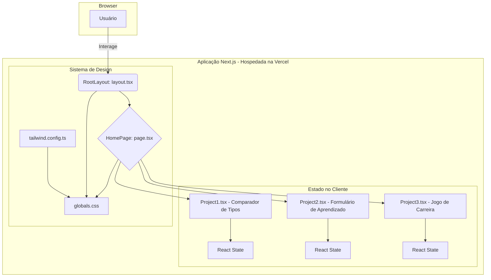

<div align="center">

# Seven Days of Code

[](https://github.com/ESousa97/seven-of-days-code/actions/workflows/ci.yml)
[](https://github.com/ESousa97/seven-of-days-code/actions/workflows/codeql.yml)
[](https://www.codefactor.io/repository/github/esousa97/seven-of-days-code)
[](https://github.com/ESousa97/seven-of-days-code)
[](https://github.com/ESousa97/seven-of-days-code)
[](https://opensource.org/licenses/MIT)
[](#)

**Aplicação web educacional para exploração interativa de fundamentos da programação através de desafios práticos com Next.js e React.**

[Ver Demo Online](https://seven-of-days-code.vercel.app)

</div>

---

> **⚠️ Projeto Arquivado**
> Este projeto não recebe mais atualizações ou correções. O código permanece disponível como referência e pode ser utilizado livremente sob a licença MIT. Fique à vontade para fazer fork caso deseje continuar o desenvolvimento.

---

## Índice

- [Sobre o Projeto](#sobre-o-projeto)
- [Demonstração](#demonstração)
- [Arquitetura](#arquitetura)
- [Funcionalidades](#funcionalidades)
- [Tecnologias](#tecnologias)
- [Começando](#começando)
  - [Pré-requisitos](#pré-requisitos)
  - [Instalação](#instalação)
  - [Uso Local](#uso-local)
- [Scripts Disponíveis](#scripts-disponíveis)
- [Estrutura do Projeto](#estrutura-do-projeto)
- [Casos de Uso](#casos-de-uso)
- [Testes](#testes)
- [Deploy](#deploy)
- [FAQ](#faq)
- [Contribuição](#contribuição)
- [Licença](#licença)
- [Contato](#contato)

---

## Sobre o Projeto

Seven Days of Code é uma aplicação web educacional desenvolvida em resposta ao desafio homônimo da Alura. O propósito fundamental é transpor a lacuna entre o conhecimento teórico dos fundamentos da programação e sua aplicação pragmática no ecossistema de desenvolvimento web moderno.

O desafio central abordado é a dificuldade que aprendizes frequentemente encontram em visualizar e interagir com conceitos lógicos abstratos. A solução consiste em uma aplicação single-page composta por três módulos interativos e autocontidos, onde cada um encapsula um desafio de programação fundamental.

O repositório implementa:

- **Módulos Interativos** — Três projetos independentes explorando conceitos fundamentais
- **Feedback Visual Imediato** — Toda interação gera resposta visual clara e imediata
- **Arquitetura Moderna** — Next.js 14 App Router com React 18
- **Type-Safety Completa** — TypeScript em toda a base de código
- **Design Responsivo** — Tailwind CSS com sistema de design customizado
- **Deploy Automatizado** — CI/CD integrado com Vercel

---

## Demonstração


**Acesse o projeto online:** [seven-of-days-code.vercel.app](https://seven-of-days-code.vercel.app)

---

## Arquitetura

### Arquitetura do Sistema

A aplicação foi concebida como um **Monólito Front-end** com renderização primariamente no lado do cliente (Client-Side Rendering - CSR), utilizando a arquitetura do **App Router** do Next.js.



### Decisões Arquiteturais

- **Next.js App Router** — Base sólida com roteamento baseado em sistema de arquivos
- **Arquitetura de Componentes** — Cada projeto é um componente React independente
- **Gerenciamento de Estado Local** — Hooks nativos do React (useState, useEffect)
- **Importações Dinâmicas** — Code-splitting via `next/dynamic` para otimização
- **Tailwind CSS** — Abordagem utility-first para criação rápida de UI customizada

---

## Funcionalidades

### 1. Comparador de Tipos

Demonstra a diferença crítica entre igualdade flexível (`==`) e estrita (`===`) em JavaScript, mostrando coerção de tipo de forma visual.

**Exemplo:** Comparar número `1` com string `'1'` exibe resultado com mensagem contextualizada sobre coerção de tipo.

### 2. Formulário de Aprendizado

Exercita manuseio de formulários, validação de entradas, gerenciamento de estado e renderização condicional baseada nas respostas do usuário.

**Exemplo:** Usuário preenche dados e recebe feedback personalizado baseado em suas escolhas.

### 3. Jogo de Escolhas de Carreira

Simula árvore de decisão (wizard passo a passo), gerenciando estado construído progressivamente através de múltiplas interações.

**Exemplo:** Usuário escolhe área (Front-End/Back-End), tecnologias e tipo de especialização, recebendo resumo completo ao final.

---

## Tecnologias

### Core


### Ferramentas de Desenvolvimento


| Categoria | Tecnologia | Versão | Propósito |
|-----------|------------|--------|-----------|
| **Framework** | Next.js | 14.2.4 | Estrutura principal, roteamento e otimizações |
| **Biblioteca UI** | React | ^18 | Interface baseada em componentes |
| **Linguagem** | TypeScript | ^5 | Tipagem estática e robustez |
| **Estilização** | Tailwind CSS | ^3.4.1 | Framework CSS utility-first |
| **Linting** | ESLint | ^8 | Análise estática de código |
| **Deployment** | Vercel | N/A | Hospedagem e CI/CD |

**Requisitos mínimos:**

- Node.js 18.17.0+ (recomendado)
- npm 9.6.7+
- Git (latest)

---

## Começando

### Pré-requisitos

```bash
node --version  # v18.17.0 ou superior
npm --version   # v9.6.7 ou superior
```

**Editor recomendado:** Visual Studio Code com extensões:
- ESLint
- Prettier - Code formatter
- Tailwind CSS IntelliSense

### Instalação

1. **Clone o repositório**

```bash
git clone https://github.com/ESousa97/seven-of-days-code.git
cd seven-of-days-code
```

2. **Instale as dependências**

```bash
npm install
```

### Uso Local

**Subir o servidor de desenvolvimento:**

```bash
npm run dev
```

Acesse: `http://localhost:3000`

Alterações no código são refletidas automaticamente com Fast Refresh.

---

## Scripts Disponíveis

```bash
# Servidor de desenvolvimento com Fast Refresh
npm run dev

# Build de produção otimizado
npm run build

# Executa build de produção localmente
npm run start

# Análise de código com ESLint
npm run lint

# Executar testes automatizados
npm test
```

---

## Estrutura do Projeto

```
seven-of-days-code/
├── .next/                    # Build do Next.js (ignorado)
├── node_modules/             # Dependências (ignorado)
├── components/
│   └── projects/
│       ├── Project1.tsx      # Comparador de Tipos
│       ├── Project2.tsx      # Formulário de Aprendizado
│       └── Project3.tsx      # Jogo de Carreira
├── public/
│   ├── demo.gif              # Demonstração do projeto
│   ├── next.svg
│   └── vercel.svg
├── src/
│   └── app/
│       ├── favicon.ico       # Ícone do site
│       ├── globals.css       # Estilos globais + Tailwind
│       ├── layout.tsx        # Layout raiz (html, body)
│       └── page.tsx          # Página principal
├── tests/                    # Testes automatizados
├── .eslintrc.json            # Configuração ESLint
├── .gitignore                # Arquivos ignorados
├── next.config.mjs           # Configuração Next.js
├── package.json              # Dependências e scripts
├── tailwind.config.ts        # Configuração Tailwind
├── tsconfig.json             # Configuração TypeScript
└── README.md                 # Este arquivo
```

---

## Casos de Uso

### Caso de Uso 1: Comparador de Tipos

**Cenário:** Desenvolvedor júnior aprende sobre coerção de tipos.

**Ação:** Insere número `1` no primeiro campo e string `'1'` no segundo.

**Resultado:** Interface exibe mensagem: "1 == '1' → Mesmos valores com coerção de tipo" com ícone de aviso, fornecendo compreensão instantânea.

### Caso de Uso 2: Formulário de Aprendizado

**Cenário:** Estudante explora feedback condicional.

**Ação:** Preenche formulário com nome, idade e linguagem. Seleciona "Sim, estou gostando".

**Resultado:** Formulário é substituído por card de sucesso com mensagem personalizada.

### Caso de Uso 3: Jogo de Carreira

**Cenário:** Usuário planeja caminho de aprendizado.

**Passos:**
1. Escolhe "Front-End"
2. Seleciona "React"
3. Escolhe "Especialização"
4. Adiciona "TypeScript" e "Next.js"

**Resultado:** Exibe resumo completo do plano de carreira escolhido.

---

## Testes

### Estratégia de Testes

O projeto possui suíte de testes básica usando o runner nativo do Node (`node --test`), localizada em `tests/`.

```bash
# Executar testes
npm test
```

### Qualidade de Código

- **TypeScript** — Segurança de tipos e prevenção de erros
- **ESLint** — Configurado com `next/core-web-vitals`
- **Análise estática** — Validação automática em cada commit

---

## Deploy

### Plataforma

Implantado na **Vercel**, plataforma otimizada para frameworks front-end.

### Processo CI/CD

1. `git push` para branch `main` aciona build automático
2. Vercel executa `next build` e otimiza ativos
3. Build bem-sucedido é implantado atomicamente
4. Pull Requests geram Deploy Previews

### Escalabilidade

Arquitetura servida pela Edge Network global da Vercel. Ativos cacheados em múltiplos locais garantem baixa latência mundial.

**URL de produção:** [seven-of-days-code.vercel.app](https://seven-of-days-code.vercel.app)

---

## FAQ

### Por que usar Next.js para aplicação client-side?

Next.js oferece servidor de desenvolvimento rápido com Fast Refresh, otimizações automáticas (minificação, code-splitting), roteamento robusto e deployment simples via Vercel. Fornece base sólida facilmente extensível.

### Existem dependências de backend?

Não. O projeto é 100% front-end. Toda lógica e estado são gerenciados no navegador.

### Como adicionar novo projeto?

1. Crie componente React em `components/projects/`
2. Importe dinamicamente em `src/app/page.tsx` usando `next/dynamic`
3. Adicione nova `<section>` no JSX seguindo estrutura existente

### O projeto é responsivo?

Sim, totalmente responsivo através do Tailwind CSS, adaptando-se a diferentes tamanhos de tela.

---

## Contribuição

Contribuições são bem-vindas! Para contribuir:

1. **Fork o projeto**
2. **Crie uma branch para sua feature:**
   ```bash
   git checkout -b feature/minha-feature
   ```
3. **Commit suas mudanças:**
   ```bash
   git commit -m "Adiciona nova funcionalidade"
   ```
4. **Push para a branch:**
   ```bash
   git push origin feature/minha-feature
   ```
5. **Abra um Pull Request**

### Diretrizes

- Siga os padrões de código existentes
- Adicione testes para novas funcionalidades
- Atualize a documentação quando necessário
- Reporte bugs através das [Issues](https://github.com/ESousa97/seven-of-days-code/issues)

---

## Licença

Este projeto está sob a licença MIT. Veja o arquivo [LICENSE](LICENSE) para mais detalhes.

```
MIT License - você pode usar, copiar, modificar e distribuir este código.
```

---

## Contato

**José Enoque Costa de Sousa**

[](https://www.linkedin.com/in/enoque-sousa-bb89aa168/)
[](https://github.com/SousaDev97)
[](https://enoquesousa.vercel.app)

**Encontrou um bug?** [Abra uma Issue](https://github.com/ESousa97/seven-of-days-code/issues)  
**Tem uma sugestão?** [Inicie uma Discussion](https://github.com/ESousa97/seven-of-days-code/discussions)  
**Precisa de ajuda?** Entre em contato via LinkedIn

---

<div align="center">

**[⬆ Voltar ao topo](#seven-days-of-code)**

Feito com ❤️ por [José Enoque](https://github.com/SousaDev97)

**Status do Projeto:** Archived — Sem novas atualizações

</div>
